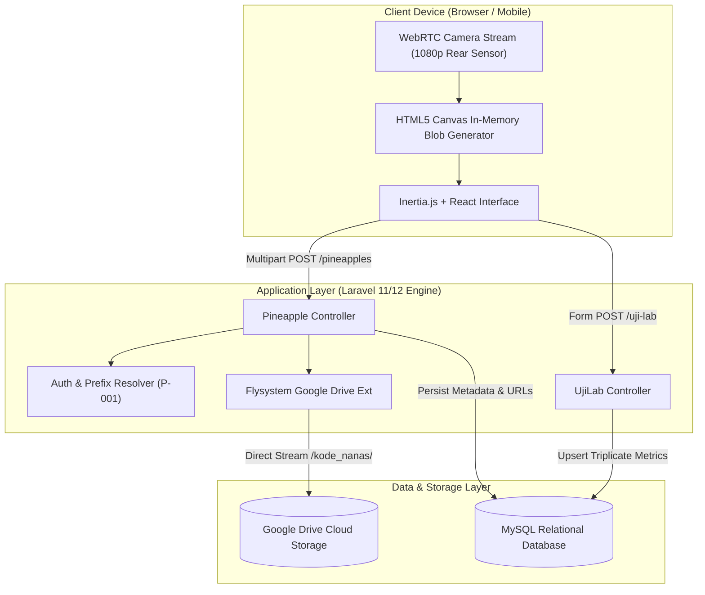
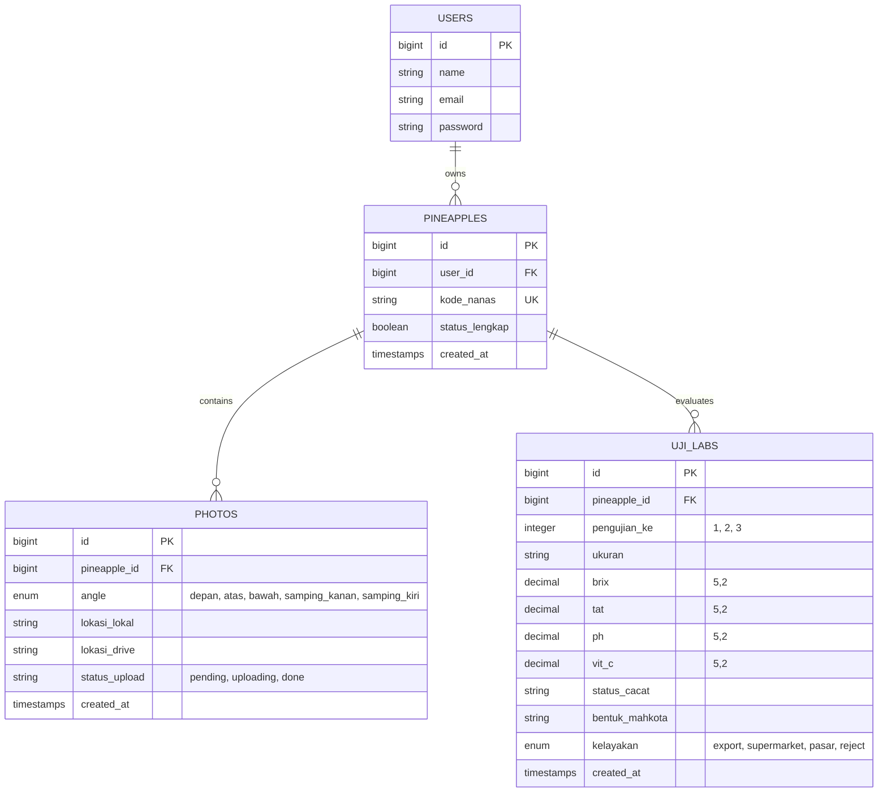

# FotoNanas — Multi-Angle Image Dataset & Laboratory Quality Analysis Platform

[](https://laravel.com)
[](https://inertiajs.com)
[](https://react.dev)
[](https://tailwindcss.com)
[](https://php.net)
[](https://www.mysql.com)
[](https://developers.google.com/drive)

---

## 📌 Project Overview

**FotoNanas** is an integrated data acquisition, digital imaging, and physico-chemical quality analysis platform engineered to support academic research conducted by **Lecturer Dwi Vernanda**.

The platform provides a streamlined, zero-friction pipeline for capturing standardized multi-angle photographic datasets of pineapple specimens, streaming high-resolution captures directly into cloud storage, and recording multi-trial laboratory assay metrics (sugar content/Brix, titratable acidity, pH, ascorbic acid/Vitamin C, morphology, defect classification, and commercial market grading).

---

## 🎯 Research Context & Objectives

In agricultural engineering and post-harvest computer vision research, obtaining a consistent, systematically labeled image dataset alongside empirical laboratory assay results is critical for machine learning modeling and quality grading algorithms.

This system was engineered to:
1. **Eliminate Human Labeling Errors**: Automated generation of alphanumeric specimen identifiers (e.g., `P-001`, `P-002`) tied directly to researchers' credentials.
2. **Standardize Visual Inspection Angles**: A mandatory guided 5-angle capture workflow (Front, Top, Bottom, Right Side, Left Side) utilizing direct device camera hardware integration.
3. **Zero-Friction Cloud Storage**: Immediate streaming of in-memory image buffers directly to Google Drive via Flysystem integration, bypassing server storage overhead.
4. **Comprehensive Laboratory Quality Logging**: Support for triplicated analytical runs (`pengujian_ke: 1, 2, 3`) tracking physico-chemical properties alongside visual grading.
5. **Instant Research Export**: Built-in native spreadsheet generation for rapid statistical analysis in SPSS, Python, or R.

---

## 🏛️ System Architecture



---

## 🔬 Core Features & Modules

### 1. Multi-Angle Guided Camera Pipeline (`/dashboard`)
- **Direct Hardware Interfacing**: Uses WebRTC `navigator.mediaDevices.getUserMedia` with forced `environment` (rear camera) mode and target Full HD (`1920x1080`) resolution.
- **5-Point Angle Standard**:
  - `depan` (Front view)
  - `atas` (Top view / Crown insertion)
  - `bawah` (Bottom view / Base)
  - `samping_kanan` (Right lateral profile)
  - `samping_kiri` (Left lateral profile)
- **Lossless In-Memory Capture**: Native HTML5 Canvas rendering converting camera frames directly into full-quality JPEG blobs (`canvas.toBlob(..., 1.0)`).
- **Auto-Sequence Code Generation**: Parses historical records to generate consecutive codes (e.g., researcher "Prabu" -> `P-001`, `P-002`).

### 2. Direct Cloud Streaming
- Direct memory-to-cloud upload using `masbug/flysystem-google-drive-ext`.
- Dedicated directories created per specimen (`{kode_nanas}/{kode_nanas}_{angle}.jpg`).
- Asynchronous status tracking (`pending`, `done`) with resilient error logging.

### 3. Triplicate Laboratory Assay Management (`/uji-lab`)
- Multi-run tracking per specimen (Testing Iterations 1, 2, and 3).
- **Physico-Chemical Metrics**:
  - **Brix (°Bx)**: Soluble solids content / sugar percentage.
  - **TAT (Total Titratable Acidity)**: Acid concentration indicator.
  - **pH**: Acidity levels.
  - **Vitamin C (mg/100g)**: Ascorbic acid concentration.
- **Physical & Morphological Grading**:
  - **Ukuran**: Physical size category.
  - **Bentuk Mahkota**: Crown morphology.
  - **Status Cacat**: Surface blemishes, bruises, or fungal occurrences.
  - **Kelayakan**: Market categorization (`export`, `supermarket`, `pasar`, `reject`).
- **Upsert Persistence Engine**: Seamlessly updates existing iterations or appends new analytical runs via `UjiLab::updateOrCreate`.

### 4. Data Exploration & Native Research Export
- Real-time client-side search & filtering across codes, classifications, defect statuses, and crown shapes.
- Browser-native HTML table-to-Excel `.xls` generator for immediate integration with data science workflows.

---

## 🗄️ Database Architecture



---

## 🛠️ Technology Stack

| Layer | Technology | Purpose in System |
| :--- | :--- | :--- |
| **Backend Framework** | Laravel 11/12 (PHP 8.3) | Core application routing, authentication, API endpoints, Eloquent ORM |
| **Frontend Framework** | React 18 + Inertia.js v2 | Single-page application lifecycle, state synchronization without REST overhead |
| **Styling & Design** | Tailwind CSS | Modern responsive mobile-first laboratory interface |
| **Database** | MySQL | Relational data persistence with foreign keys and cascading deletes |
| **Cloud Integration** | Google Drive API / Flysystem | Remote streaming storage for high-res biological dataset images |
| **Hardware Interfacing** | WebRTC + HTML5 Canvas API | High-resolution direct camera capture from field/laboratory devices |
| **Build & Tooling** | Vite 8 + Pest PHP | High-speed frontend bundling and automated testing |

---

## 🚀 Installation & Local Setup

### Prerequisites
- **PHP** >= 8.3 (with `pdo_mysql`, `gd` or `imagick`, `curl`, `fileinfo`)
- **Composer** >= 2.0
- **Node.js** >= 18.x & **NPM**
- **MySQL** >= 8.0 or MariaDB >= 10.4

### Quick Start

1. **Clone the Repository**
   ```bash
   git clone https://github.com/SukemaruMomo666/fotonanas.git
   cd fotonanas
   ```

2. **Install PHP & Node Dependencies**
   ```bash
   composer install
   npm install
   ```

3. **Environment Setup**
   ```bash
   cp .env.example .env
   php artisan key:generate
   ```

4. **Configure Database & Google Drive Credentials**
   Update `.env`:
   ```env
   DB_CONNECTION=mysql
   DB_HOST=127.0.0.1
   DB_PORT=3306
   DB_DATABASE=fotonanas
   DB_USERNAME=root
   DB_PASSWORD=

   FILESYSTEM_DISK=google
   GOOGLE_DRIVE_CLIENT_ID=your_client_id
   GOOGLE_DRIVE_CLIENT_SECRET=your_client_secret
   GOOGLE_DRIVE_REFRESH_TOKEN=your_refresh_token
   GOOGLE_DRIVE_FOLDER_ID=your_target_folder_id
   ```

5. **Run Migrations**
   ```bash
   php artisan migrate
   ```

6. **Launch Development Servers**
   ```bash
   npm run dev
   php artisan serve
   ```

---

## 📋 Solo Project

**Designed, architected, and developed by Prabu Alam Tian Try Suherman — Lead Architect & Full-Stack Master.**

This software was engineered as an independent solo project to facilitate, automate, and accelerate the field data collection and laboratory analytical research of **Lecturer Dwi Vernanda**.

### My Role & Key Contributions

**Prabu Alam Tian Try Suherman**  
*Lead Architect & Full-Stack Master*

- **System & Solution Architecture**: Designed the end-to-end data acquisition workflow, from field capture to automated laboratory data processing.
- **Hardware & WebRTC Integration**: Built the browser-based camera pipeline utilizing high-resolution canvas capture for multi-angle standardization.
- **Cloud Storage Engineering**: Integrated direct Google Drive streaming via Flysystem extension, preventing local disk accumulation and streamlining backup.
- **Database Modeling**: Architected the relational schema supporting multi-trial laboratory observations (`UjiLab`) and visual specimen indexing (`Pineapple` & `Photo`).
- **Full-Stack Implementation**: Developed the unified Laravel 11/12 + Inertia.js React frontend, complete with real-time filtering and native Excel report export.
- **Technical Documentation & Rigor**: Authored architecture specifications, deployment guides, and data definitions.

---

## 👨‍💻 About the Creator

**Prabu Alam Tian Try Suherman**  
*Lead Architect & Full-Stack Master*  
Founder of **Qisa Studio**, a digital product studio focused on website development, application development, and digitalization.

Prabu focuses on architecting scalable, high-performance systems and executing complex end-to-end applications — from system analysis and architecture to UI/UX, development, database design, hardware integration, testing, deployment, and optimization.

**Areas of Focus:**
- System Architecture & Scalable System Design
- Full-Stack Engineering (Laravel, Inertia.js, React, PHP, MySQL)
- Web Applications & Digital Product Development
- Digitalization & Academic Research Support Systems
- UI/UX & Interactive Interfaces
- Cloud Storage Pipelines & Hardware Interfacing

---

## 📜 Built & Architected by

**Prabu Alam Tian Try Suherman**  
*Lead Architect & Full-Stack Master*  
*Founder — Qisa Studio*

> *Architecting scalable systems. Building high-performance digital products. Turning complex ideas into working applications.*

---

## 🎓 Academic Attribution & License

- **Research Purpose**: Dedicated support for the academic research of **Lecturer Dwi Vernanda**.
- **Software License**: Open-sourced under the [MIT License](LICENSE).
